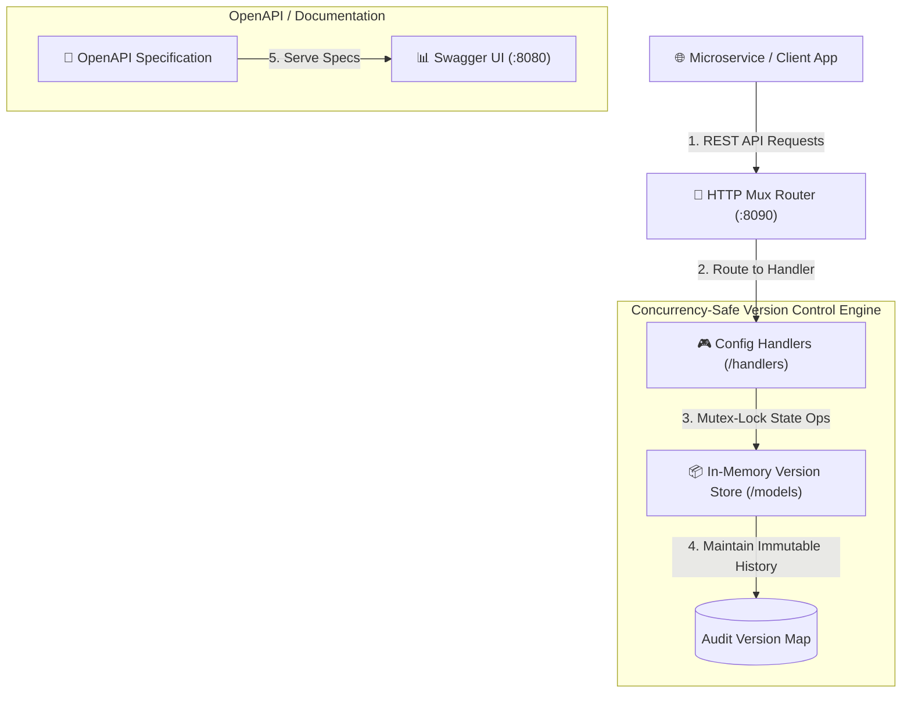
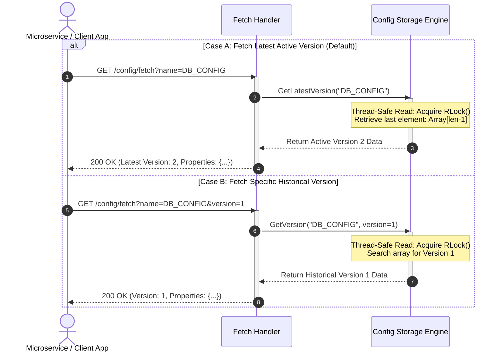
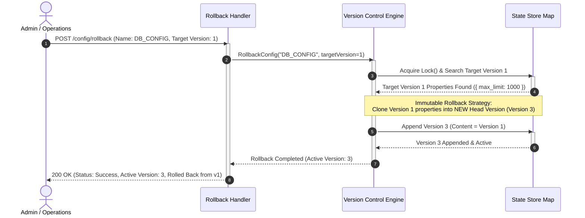

# ⚙️ Centralized Dynamic Config Management Service


High-performance, concurrency-safe Centralized Configuration & Version Control Service built in Go. Allows microservices to create, fetch, update, rollback, and audit dynamic feature flags and environment configurations in real-time with full version history.

---

## 🏗️ System Architecture & Data Flow



---

## 📊 Sequence Diagrams: Core Service Workflows

### 🔍 1. Fetch Configuration Flow (`GET /config/fetch`)

Menjelaskan alur pembacaan konfigurasi (*P99 high-speed read*). Klien dapat mengambil versi aktif terbaru (*default*) atau versi historis tertentu.



---

### 🔄 2. Atomic Rollback Flow (`POST /config/rollback`)

Menjelaskan proses **Rollback Aman (Immutable Audit Trail)**. Saat melakukan rollback ke `version 1`, sistem **TIDAK menghapus sejarah**, melainkan melakukan *cloning* data `version 1` menjadi **versi baru (`version 3`)** agar seluruh jejak audit tetap utuh.



---

## 💡 Key Features & Business Capabilities

- **🔄 Versioning per Configuration**: Every change appends a new immutable version to the configuration audit history.
- **⚡ Instant Rollback Engine**: Atomic rollback to any historical version without restarting microservices.
- **🛡️ Type Validation**: Enforces valid config types (`DATABASE`, `API`, `FEATURE_FLAG`, etc.) and payload schemas.
- **📊 Real-time Fetch & Audit**: Query the active version or audit the complete version lifecycle (`GET /config/versions`).
- **🚀 High Concurrency**: Thread-safe memory operations designed for low-latency P99 reads.

---

## 🛠️ REST API Specification & Endpoint Matrix

| Method | Route | Description | Sample Payload | Response |
| :---: | :--- | :--- | :--- | :---: |
| `POST` | `/config` | Create a new configuration entry | `{"name":"DB_CONFIG","type":"DATABASE","versions":[{"version":1,"property":{"max_limit":1000}}]}` | `200 OK` |
| `POST` | `/config/update` | Append a new version to existing config | `{"name":"DB_CONFIG","type":"DATABASE","versions":[{"version":2,"property":{"max_limit":2000}}]}` | `200 OK` |
| `POST` | `/config/rollback` | Rollback configuration to a target version | `{"name":"DB_CONFIG","version":1}` | `200 OK` |
| `GET` | `/config/fetch` | Fetch latest or specific version | `GET /config/fetch?name=DB_CONFIG&version=1` | `200 OK` |
| `GET` | `/config/versions` | List all historical versions of a config | `GET /config/versions?name=DB_CONFIG` | `200 OK` |

---

## 🚀 Quick Start Guide

### Prerequisites
- Go `1.22+`
- Docker & Docker Compose
- `make` utility

---

### Running Locally with Go

```bash
# 1. Clone repository
git clone https://github.com/goesbams/config-management-service.git
cd config-management-service

# 2. Run unit tests (All tests pass)
make test

# 3. Start the service
make run
```

The REST API service will listen on `http://localhost:8090`.

---

### Running via Docker & OpenAPI Swagger

```bash
# 1. Build and start service container
make docker-build
make docker-up

# 2. View Swagger API documentation
make docker-openapi
```

Open your browser at `http://localhost:8080` to view the interactive **OpenAPI / Swagger UI**.

---

## 🧪 Local Test Verification

The unit test suite has been verified locally and passes 100%:

```bash
go test -v ./...
```

```text
=== RUN   TestCreateConfig
--- PASS: TestCreateConfig (0.00s)
=== RUN   TestUpdateConfig
--- PASS: TestUpdateConfig (0.00s)
=== RUN   TestRollbackConfig
--- PASS: TestRollbackConfig (0.00s)
=== RUN   TestFetchConfig
--- PASS: TestFetchConfig (0.00s)
=== RUN   TestListVersionsHandler
--- PASS: TestListVersionsHandler (0.00s)
PASS
ok  	github.com/goesbams/config-management-service/tests	0.415s
```

---
<sub>Designed & engineered with precision by Ando | Bambang Handoko.</sub>
